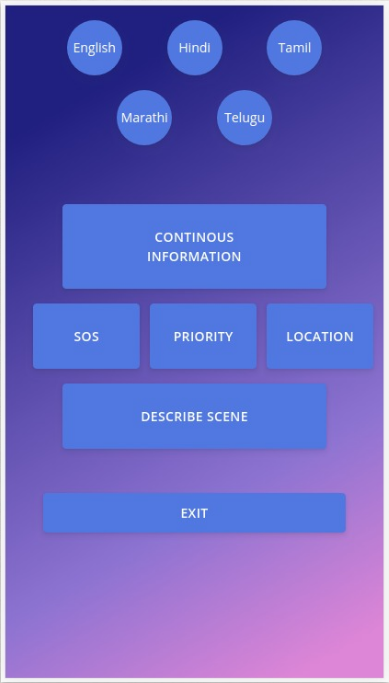
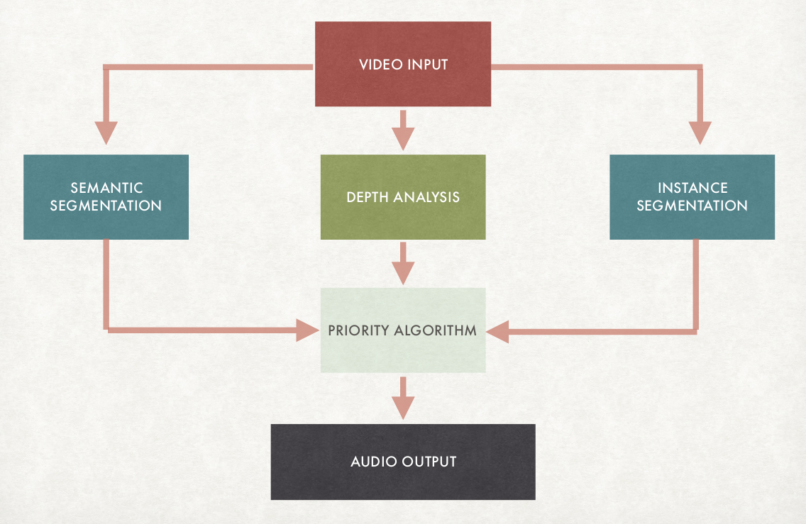

# Priority Based Alert System

## Problem Statement
Given the video stream in the front of a Visually Impaired person, tell the most significant piece of
information at any given point of time.
This is the problem statement that we choose for the CDAC AI Hackathon, India.

## Motivation
Travelling in a new environment, a visually impaired person often faces the challenges in orienting themselves, as
they are not surrounding aware and without any sighted assistance might miss a lot of vital information in the
environment including objects, obstacles and any other important situational information

  

## Our Approach
1. Find the Depth-map of the given frame coming from live video capture
2. Apply segmentation on that frame to identify different objects in the scene
3. Find the priority of each object based on depth-map and weights of objects
4. Give the message to user based on priority output

  

## How to run the code
We have developed **PWA** app from the webview, which user can use to capture the video, the frames of the video
will be sent to the flask backend framework, where the models are already loaded. The flask model will return the
message output to the app and that will given to the user in the speech format.

**Running the PWA**
1. source Environment/bin/activate
2. `pip install -r requirements.txt`
3. Configure the phone and the PC on which code will be run on the same network
4. `cd Streaming`
5. `python server.py`
6. Check the IP of the PC
7. Open the browser and type `https://Your-IP-address:8000`
8. You can click on different options to see the result

**Running on the video**
1. source Environment/bin/activate
2. `pip install -r requirements.txt`
3. cd VideoTest/
4. change the video_file variable in the videoEval.py file for running the inference on video file
5. `python videoEval.py`

If you face some errors like *core dumped* then use command, `export KMP_DUPLICATE_LIB_OK=TRUE`
If the socket bind failed, check the firewall for the port 8000 and restart the server

## Directory Structure
Presentation.pdf - the presentation of the team for Round-2 
Depth_Model - the entire depth model 
Segmentation_Model - the entire segmentation model 
Priority - the entire Priority model 
Demonstration - this folder include the video demonstration of the output webview 
Streaming - this folder include the entire streaming process 

You can run the independent modules by following the readme inside each module.  

## Achievement
We were selected as the **Finalist for the CDAC AI Hackthon 2019, India**, we have developed the small prototype
that we can further work on to make life of visually impaired/blind person more comfortable

## Team
Bhushan Pagare   
Kunal Chadha  
Kunal Sinha   
Aditya Chaloo   

### Are you interested ?
- Fork the repository
- Make the changes
- Send the Pull Request :)
